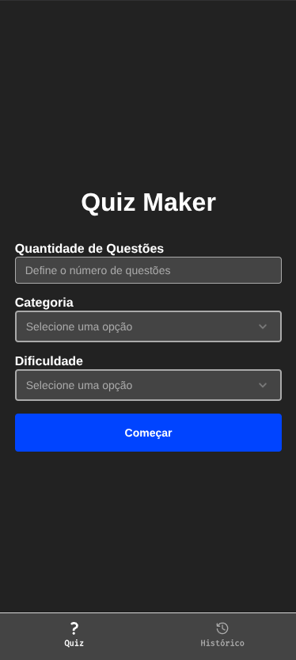
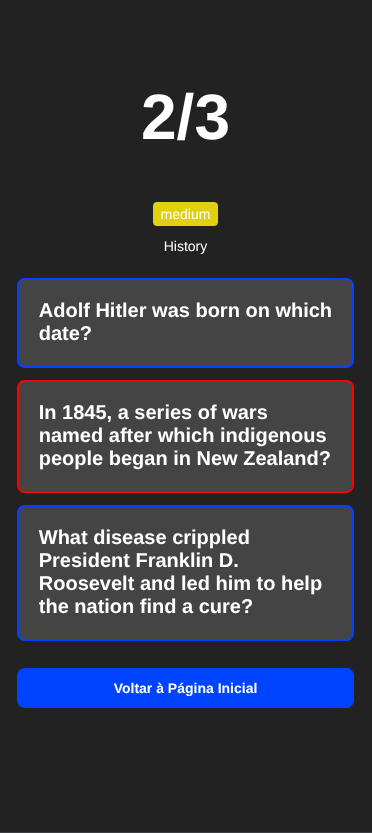
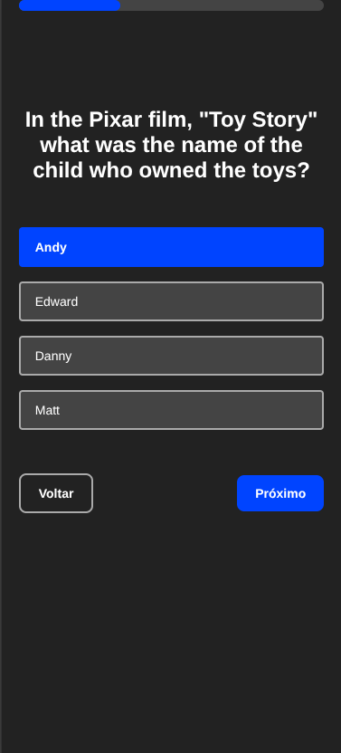

<h1 align="center">Quiz Maker</h1>

<p align="center">
  Uma aplicação mobile feita com React Native e Expo na qual o usuário pode criar quizzes rápidos para serem feitos na hora
</p>

<h2>🎨 Layout</h2>

<h3>Página Inicial</h3>
<p>
  Página inicial com um formulário simples aonde o usuário pode definir as informações do quiz, como o número de questões, categoria e dificuldade
</p>

<p align="center">
  
</p>

<h3>Histório</h3>
<p>
  Página de histórico com uma lista dos quizzes já feitos pelo usuário, permitindo que o usuário possa selcionar um dos quizzes para detalhar
</p>

<p align="center">
  
</p>

<h3>Detalhe</h3>
<p>
  Página de detalhe do quiz com informações como o total de questões, questões acertadas, dificuldade, categoria e as próprias questões do quiz, onde o usuário pode ver as respostas corretas e as dadas por ele
</p>

<p align="center">
  
</p>

<h3>Quiz</h3>
<p>
  Página de quiz traz as questões do quiz, com a pergunta no meio da tela, uma barra de progresso no topo, as opções de resposta e os botões de navegação do quiz
</p>

<p align="center">
  
</p>

<h3>API</h3>
<p>
  O sistema possui um Backend feito com Node e Express que armazena os quizzes já feitos em um banco de dados SQLite e fornece um endpoint para listagem e outro para criação
</p>

<h2>💻 Tecnologias</h2>

- React Native
- Expo
- Expo Router
- React Hook Form
- Node
- Express
- SQLite

<h2 id="started">🚀 Getting started</h2>

<h3>Prerequisites</h3>

- Git
- Node

<h3>Cloning</h3>

```bash
git clone https://github.com/lucasNBS/quiz-app
```

<h3>Starting</h3>

```bash
# Em um terminal
cd quiz
npm install
npm run start

# Em outro terminal
cd quiz-backend
npm install
npm run dev
```

Projeto estará rodando em http://localhost:8081
